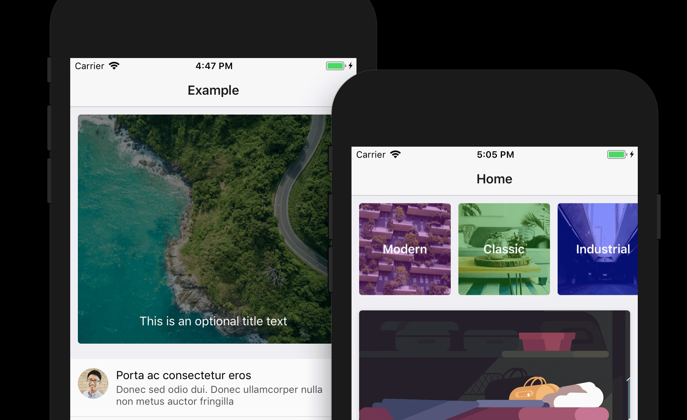
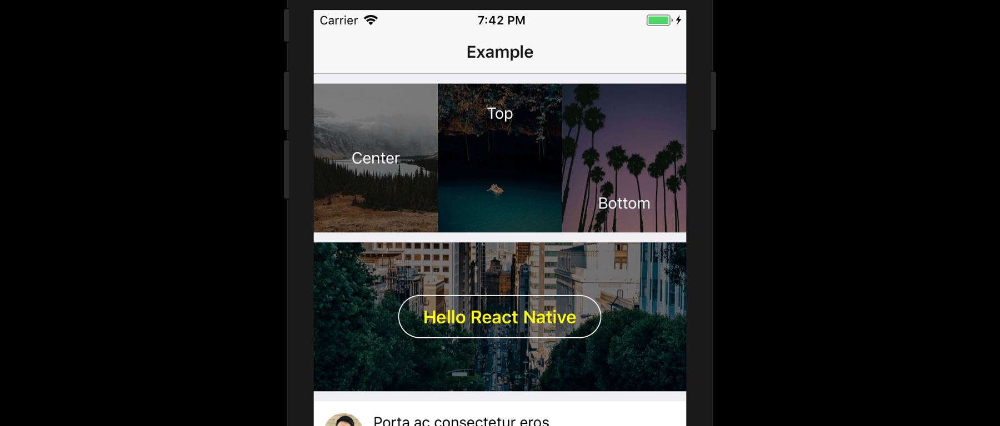
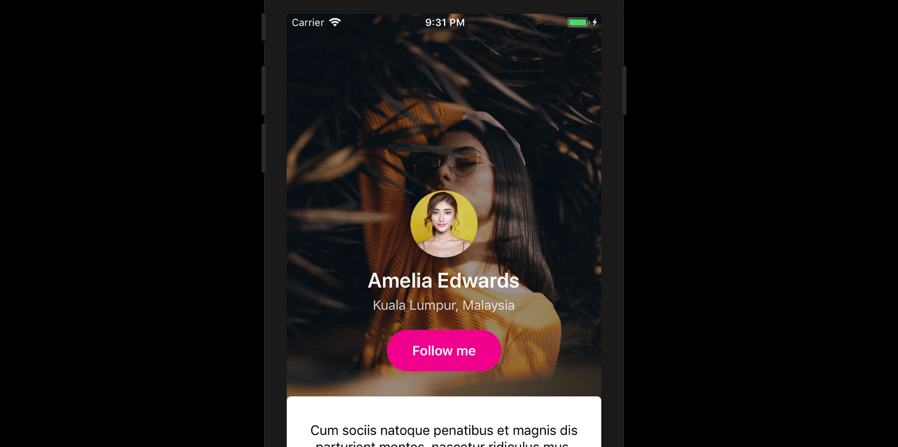

<h1 align="center">
    react-native-image-overlay
</h1>
<p align="center">React Native <code>ImageBackground</code> is useful. But you know what's even more useful?<br />
<code>ImageBackground</code> with overlay. This is exactly it.</p>



<br />

## Get Started

### Installation
```bash
$ npm install --save react-native-image-overlay
```

### Usage
```javascript
import ImageOverlay from "react-native-image-overlay";

export class MyApp extends Component {
    render () {
        return (
            // For external image
            <ImageOverlay source={{ uri:"http://example.com/img/cool.jpg" }} />
            // For local asset
            <ImageOverlay source={require("../../assets/banner.png")} />
        )
    }
}
```

<br />

## Props

| Prop              | Description                                                                                | Type                | Default     |
| ----------------- | ------------------------------------------------------------------------------------------ | ------------------- | ----------- |
| `blurRadius`      | The blur radius of the blur filter added to the image                                      | Number              | `undefined` |
| `containerStyle`  | Additional styling for the component                                                       | ViewStyle               | `undefined` |
| `contentPosition` | Position of `title` text or child component (if any). | String (`"top"`,`"center"` or `"bottom"`)              | `"center"`  |
| `height`          | The height of the whole component                                                          | Number              | `300`       |
| `overlayColor`    | The color to be used for the overlay on top of the image                                   | String              | `"#000000"` |
| `overlayAlpha`    | Opacity value of the overlay. From `0` to `1`                                              | Number              | `0.5`       |
| `rounded`         | Value for `borderRadius` to be applied to the component                                    | Number              | `undefined` |
| `source`          | The image source (either a remote URL or a local file resource).                           | ImageSource |             |
| `title`           | Text to be displayed over the image                                                        | String              | `undefined` |
| `titleStyle`      | Additional styling for the title text                                                      | TextStyle               | `undefined` |

<br />

## Example

### 1. Simple overlay color

The most basic use-case of this module is to add colored overlay on top of your image.
```javascript
<ImageOverlay source={{ uri:"http://example.com/img/cool.jpg" }} />
```
Default overlay is color is `#000000` with `0.5` opacity. You can customize it to any color
```javascript
<ImageOverlay
    source={{ uri:"http://example.com/img/cool.jpg" }}
    overlayColor="cyan"
    overlayAlpha={0.8} />
```
### 2. Overlay with title text



If you want to display a simple white text on top of the image, you can use the `title` prop.
```javascript
<ImageOverlay
    source={{ uri:"http://example.com/img/cool.jpg" }}
    title="This is the title" />
```
The title will be `center`-ed by default. You can move it to the `top` or `bottom` using the `contentPosition` prop
```javascript
<ImageOverlay
    source={{ uri:"http://example.com/img/cool.jpg" }}
    title="This is the title"
    contentPosition="bottom" />
```

Additionally, you can change the styling by passing the `titleStyle` along
```javascript
<ImageOverlay
    source={{ uri:"http://example.com/img/cool.jpg" }}
    title="This is the title"
    titleStyle={{ color: 'yellow', fontWeight: 'bold' }} />
```

### 3. Overlay with child component



You can pass extra components to be displayed on top of your image.
```javascript
<ImageOverlay
  source={{ uri:"http://example.com/img/cool.jpg" }}
  height={0.7 * height} 
  contentPosition="bottom">
    <View>
        <Image style={styles.avatar} source={{uri:"http://example.com/user/avatar.png"}} />
        <Text style={styles.name}>Amelia Edwards</Text>
        <Text style={styles.location}>Kuala Lumpur, Malaysia</Text>
        <Button text="Follow me" />
    </View>
</ImageOverlay>
```
> Note: When you are using child component, `title` prop will be ignored.
